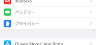
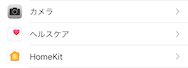
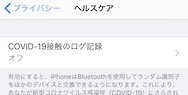
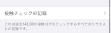
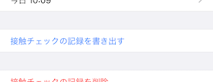
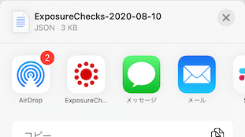
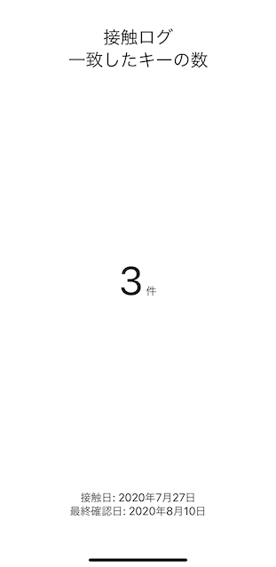

# 接触ログ確認ツール

COVID-19 の接触確認アプリで収集された接触のログ記録(JSON)を解析して接触件数を表示するアプリです。

## アプリをインストールする

### 要求環境

* iOS 13.5+
* Xcode 11.6+
* Swift 5.0+

### ビルド & インストール方法

1. Xcode で [ExposureCheck.xcodeproj](ExposureCheck.xcodeproj) を開きます。
2. 左側のプロジェクトナビゲーターから、ルートにある ExposureCheck を選択します。
3. 画面中央の Signing & Capabilities タブを選択し、Team に自身の Apple Developer Account を指定します。
4. 端末を接続して、メニューから Product > Run を選択します。 

## 使い方

1. (iOS13の場合) iPhoneの設定からプライバシー>ヘルスケア>COVID-19接触のログ記録>接触チェックの記録の順に選択します 
 (iOS14の場合) iPhoneの設定から接触通知>接触のログ記録の順に選択します

    |  (1) プライバシー |
    | :-------------: |
    |   |

    |  (2) ヘルスケア |
    | :-------------: |
    |   |

    |  (3) COVID-19接触のログ記録 |
    | :-------------: |
    |   |

    |  (4) 接触チェックの記録 |
    | :-------------: |
    |   |

2. リストを下までスクロールし、「接触のチェックを書き出す」を選択します

    |  接触のチェックを書き出す |
    | :-------------: |
    |   |

3. 表示されるアプリのリストからExposureCheckを選択します

    |  ExposureCheckを選択 |
    | :-------------: |
    |   |

4. 書き出されたJSONファイルが解析され、接触件数が表示されます

## スクリーンショット

## 作成者

Watanabe Toshinori – toshinori_watanabe@tiny.blue

## ライセンス

このプロジェクトはMITライセンスです。詳細は [ライセンス](LICENSE) ファイルを参照してください。
